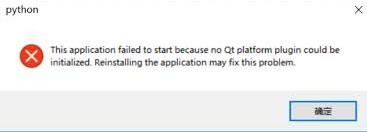
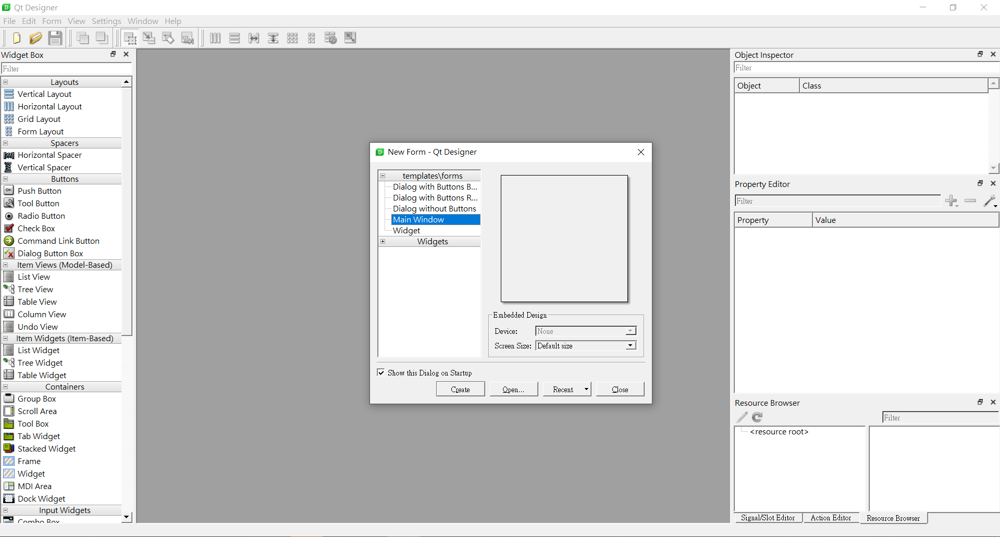
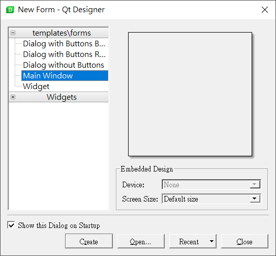
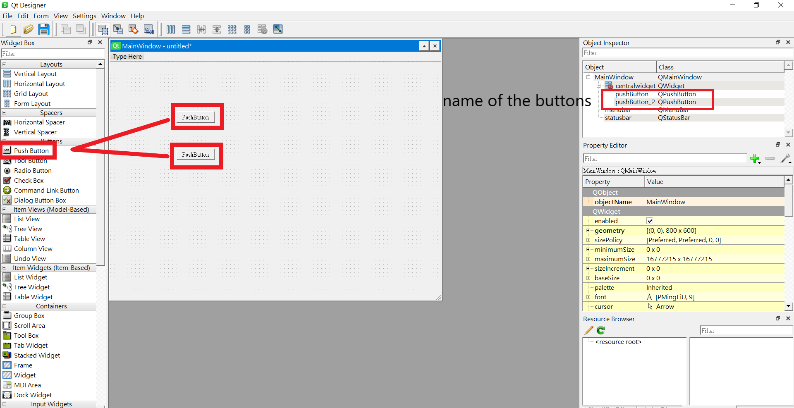
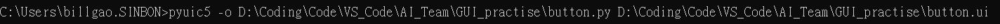
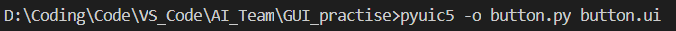
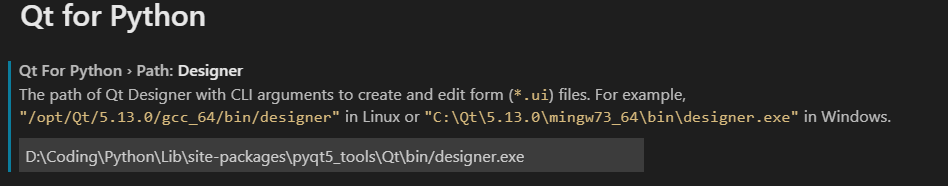
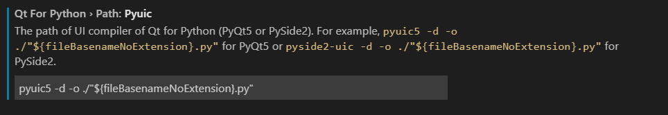
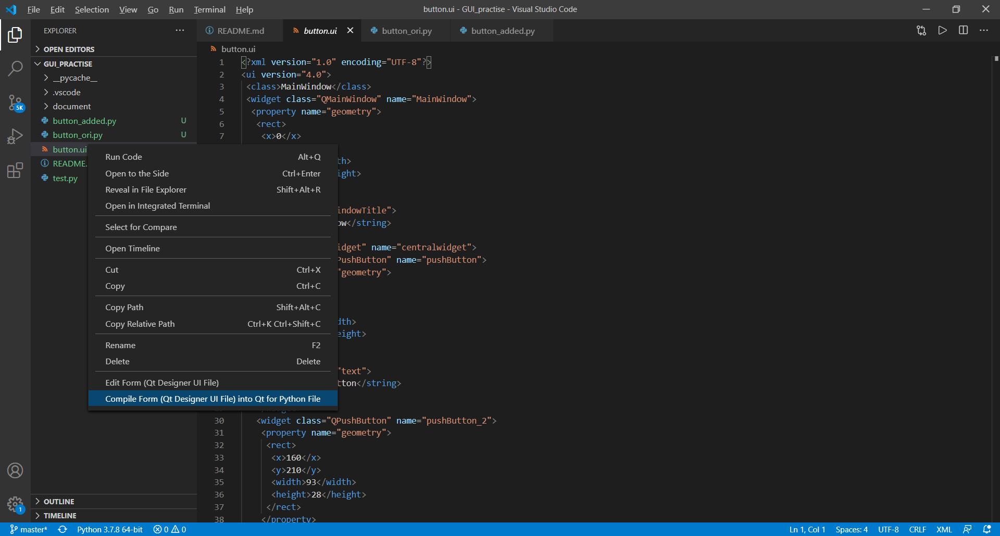

# pyqt5 tutorial

## Installation

- Environment: Python 3.7, Windows10
    
    1. Use command to install pyqt5 and some necessary tools
    ```bash
        pip install pyqt5
        pip install pyqt5-sip
        pip install pyqt5-tools
    ```

## Qt Designer

Qt Designer is a tool for quickly building graphical user interfaces with widgets from the Qt GUI framework. It gives you a simple drag-and-drop interface for laying out components such as buttons, text fields, combo boxes and more.

- intallation erorr:
    - PyQt5 Designer error "no Qt platform plugin could be initialized"
    <div align="center"> 

     
    </div>

    1. Go to => Python/lib/site-packages/PyQt5/Qt/plugins
    2. In plugins copy **platform** folder
    3. After that go to Python/lib/site-packages/pyqt5_tools/Qt/bin
    4. paste folder here . Do copy and replace.

    Then it should work

- Quick start
    1. Go find your qt designer, the path should be similar to this:
    
        >   ....\Python\Lib\site-packages\pyqt5_tools\Qt\bin\designer.exe
    
    2. Open it and you should see this
    

    3. Select Main Window, then click create button
    

    4. Drag "Push Button" to the MainWindow
    

    5. Save it as a .ui file to your file

    6. Before programming, we should convert it from a .ui file to a .py file. You can either use terminal to do it, or your IDE.
    
        Here is the command:
        

        It could simplify the converting process if you get in the path at first then convert, for example:
        

        <div align="center">  or </div>
    
        > pyuic -o YOUR_PI_FILE.py YOUR_UI_FILE.py

        <br>

        - For VS Code:
            Install the extention "Qt for Python" and follow the steps below.

            i. Set the path of Qt Designer
              

            ii. Copy the code
            

            iii. Right-click the wanted .ui file
            

        
    7. So far you already get a class for a user interface that you just did in the Qt Designer, now let's start programming


## Information:

- Installation：
    > https://xdxdyayaya.pixnet.net/blog/post/305216282  
    > https://b0212066.pixnet.net/blog/post/216632238-pyqt5-%E5%AD%B8%E7%BF%92%E7%AD%86%E8%A8%98

- .ui -> .py:
    > https://www.jianshu.com/p/43300f85af3e

- 視窗呼叫(Window Calling)：
    > https://www.itread01.com/content/1545146123.html

- 對話框(MessageBox:
    > https://blog.csdn.net/a359680405/article/details/45152131  
    > https://pythonbasics.org/pyqt-qmessagebox/  
    > https://www.cnblogs.com/linyfeng/p/11223711.html

- 列表(ListView):
    > https://zhuanlan.zhihu.com/p/57965283
    > https://blog.csdn.net/jia666666/article/details/81624550

- CheckBox:
    > https://www.delftstack.com/zh-tw/tutorial/pyqt5/pyqt5-checkbox/

- 下拉式選單-單選(ComboBox - multiple choice):
    > https://www.geeksforgeeks.org/pyqt5-setting-current-text-in-combobox/  
    > https://blog.csdn.net/qq_38161040/article/details/89742462

- 下拉式選單(複選)(ComboBox - multiple choice(can pick more than one option)):  
    > https://learnku.com/articles/42618  
    > https://www.cnblogs.com/TM0831/p/12588841.html  
    > https://blog.csdn.net/wowocpp/article/details/106232247  

- spinBox:
    > https://blog.csdn.net/jia666666/article/details/81534431

- menubar:
    > https://www.delftstack.com/zh-tw/tutorial/pyqt5/pyqt5-menubar/

- 使用PyQt5開啟camera:
    > https://www.geeksforgeeks.org/creating-a-camera-application-using-pyqt5/
    > https://blog.csdn.net/pursuit_zhangyu/article/details/82917321

