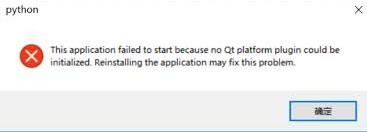

# Pyqt5 in Window 10

# Installation
Environment: Python 3.7, Windows10

- pip install
```
pip install pyqt5
pip install pyqt5-tools
```

- PyQt5 Designer error "no Qt platform plugin could be initialized"
    <div align="center"> 

     
    </div>

    1. Go to => Python/lib/site-packages/PyQt5/Qt/plugins
    2. In plugins copy **platform** folder
    3. After that go to Python/lib/site-packages/pyqt5_tools/Qt/bin
    4. paste folder here . Do copy and replace.

    Then it should work

